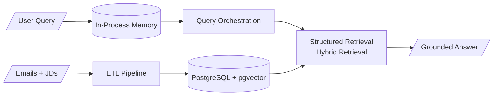

<h1 align="center">Heard Back Yet</h1>

<p align="center">
  A job application progress Q&A system for recurring questions from relatives.
</p>

<p align="center">
  <a href="https://heardbackyet.pages.dev"><strong>Try the live prototype here.</strong></a>
  <br><br>
  English | <a href="./README_ZH.md">中文</a>
</p>

## 🔍How It Works



| Key diagram | Content |
| --- | --- |
| [**RAG Query Pipeline**](./docs/rag_query_pipeline.md) | How a user query becomes an evidence-grounded answer |
| [Layered Architecture](./docs/layered_architecture.md) | The system's major layers and their responsibilities |
| [ETL Pipeline](./docs/etl_pipeline.md) | How emails and job descriptions become linked application records |


## 🚀Getting Started

This guide assumes you are running the project locally on Windows.

For a reference deployment setup, see [`docs/cloud_deployment.md`](./docs/cloud_deployment.md).

```bash
git clone https://github.com/Kaichao-Zheng/Heard-Back-Yet.git
```

### Activate the Virtual Environment

```bash
# create environment
python -m venv .venv

# activate environment
source .venv/bin/activate    # macOS/Linux
.\.venv\Scripts\activate     # Windows PowerShell
```

### Install Dependencies

```bash
pip install -r requirements.txt
```

### Configure Environment Variables

Copy the file `.env.local.example` and rename the file to `.env` in the root directory.

```env
POSTGRES_HOST=localhost
POSTGRES_PORT=5432
POSTGRES_DB=heardbackyet
POSTGRES_USER=postgres
POSTGRES_PASSWORD=postgres

MODEL_PROVIDER=ollama
# MODEL_PROVIDER=alibaba_model_studio

OLLAMA_URL=http://localhost:11434
MODEL_BASE_URL=https://your-openai-compatible-endpoint.example/v1
MODEL_API_KEY=

TEXT_CLASSIFICATION_MODEL=qwen3.6:27b
ENTITY_EXTRACTION_MODEL=qwen3.5:9b
EMBEDDING_MODEL=qwen3-embedding:4b
INTENT_CLASSIFICATION_MODEL=qwen3.6:27b
RESPONSE_GENERATION_MODEL=qwen3.6:27b
```

> [!NOTE]
>
> Local model switching can introduce cold-start latency and may exceed available VRAM when multiple models remain loaded. Hosted providers avoid local model loading but send model inputs externally. 
> 
> 1. Rebuild the vector index after changing the embedding provider or model.
> 2. `MODEL_PROVIDER=alibaba_model_studio` uses OpenAI-compatible endpoints with extensions such as `enable_thinking`.

### Run a Model API Smoke Test

This checks every unique module which configured a model.

```powershell
python -m scripts.diag.smoke_model_api
```

The complete smoke test can be slow with local Ollama because it loads multiple
models sequentially.

### Start PostgreSQL

Start the Docker PostgreSQL service defined in [`compose.yaml`](./compose.yaml):

```bash
docker compose up -d postgres
```

`PostgreSQL` can run locally, but `pgvector` is cumbersome to build on Windows. Docker avoids that setup.

### Run Workflows

Run commands from the repository root in this order.

#### 1. Add source files

- Application-related emails (`.eml`) → `data/eml/`
- Semi-structured job descriptions (`.md`) → `data/jd/`

#### 2. Process source files

```bash
python -m scripts.run_data_pipeline
```

#### 3. Normalize entity aliases manually

Follow [`scripts/normalize_aliases.md`](./scripts/normalize_aliases.md).

#### 4. Build PostgreSQL data and semantic search embeddings

```bash
# rebuild = reset + load + index
python -m scripts.manage_db rebuild

python -m scripts.manage_db reset
python -m scripts.manage_db load
python -m scripts.manage_db index
```

The `reset` command recreates the database, then applies all Alembic migrations up to the latest revision.

#### 5. Query job applications

Run the same query in different ways.

For the default local-development mode, copy `.env.local.example` to `.env`. Compose
starts PostgreSQL only, while FastAPI continues to run directly from the venv.
For the VPS mode, start from `.env.cloud.example` and use the explicit
`docker compose --profile cloud` commands in the deployment guide to activate
migration, FastAPI, and Nginx containers. The presentation MVP uses Cloudflare
HTTPS at the edge and an HTTP Nginx origin on VPS port `80`. See
[`docs/cloud_deployment.md`](./docs/cloud_deployment.md).

**Option A — Web UI**

Start the Uvicorn development server on port `8000`:

```powershell
python -m uvicorn heardbackyet.main:app --reload
```

Open [`http://localhost:8000/`](http://localhost:8000/) in your browser.

Press Ctrl+C in the **server terminal** to stop Uvicorn.

**Option B — HTTP API**

With the same Uvicorn server running, send a query from another terminal:

```powershell
curl.exe --json '{"user_query":"平安那边有消息吗","conversation_id":"demo-1"}' `
  http://localhost:8000/api/v1/responses

curl.exe --json '{"user_query":"那安克呢","conversation_id":"demo-1"}' `
  http://localhost:8000/api/v1/responses
```
Press `Ctrl+C` in the **server terminal** to stop Uvicorn.

**Option C — Diagnostic CLI**

Run the query pipeline directly **without memory**.

```powershell
python -m scripts.run_query "哪些岗位要求AWS"
```


> [!NOTE]
>
> `哪些岗位要求AWS` (`Which roles require AWS`) is a deliberately vague regression query:
>
> - It avoids cross-lingual noise from the primarily Chinese corpus.
> - It can expose UTF-8 handling issues throughout the workflow.
> - It creates a borderline choice between `missing_scope` and a summarized `content_search`.
> - It includes the exact lexical term AWS, helping validate the hybrid retrieval optimization.
>   - For this query, the semantic retriever ranks email evidence above JD.

**Bonus. Inspect diagnostic checkpoints**

See the end-to-end RAG query pipeline in [`docs/rag_query_pipeline.md`](./docs/rag_query_pipeline.md).

```powershell
# Smoke response-model access
python -m scripts.run_query "哪些岗位要求AWS" --llm-only

# Inspect retrieved evidence
python -m scripts.run_query "哪些岗位要求AWS" --evidence

# Inspect the intent-classifier handoff
python -m scripts.run_query "哪些岗位要求AWS" --query-spec
```

**Bonus. Try the lower-level retrieval tools**

```powershell
# Structured retrieval
python -m scripts.query_applications overview --limit 3

# Semantic retrieval
python -m scripts.search_chunks "Which roles sent assessments" `
  --mode semantic `
  --source-type email `
  --email-type assessment `
  --hydrate

# Lexical retrieval
python -m scripts.search_chunks "AWS" `
  --mode lexical `
  --source-type job_description `
  --hydrate

# Hybrid retrieval (semantic & lexical RRF)
python -m scripts.search_chunks "Which roles require AWS" `
  --mode hybrid `
  --source-type job_description `
  --semantic-weight 1.0 `
  --lexical-weight 1.0 `
  --hydrate
```

## 📊Evaluation

Run the commands from the repository root after
[Activating the virtual environment](#activate-the-virtual-environment).

### 1. Evaluate saved email classification results

- Expected columns require manual annotation.

```powershell
python -m scripts.eval.evaluate_email_classifier
```

**Overwrites:**

- [`data/eval/label_comparison.csv`](./data/eval/label_comparison.csv)
- [`data/eval/label_metrics.csv`](./data/eval/label_metrics.csv)

### 2. Evaluate saved email entity extraction results

- Expected columns require manual annotation.

```powershell
python -m scripts.eval.evaluate_email_entity_extractor
```

**Overwrites:**

- [`data/eval/company_comparison.csv`](./data/eval/company_comparison.csv)
- [`data/eval/company_metrics.csv`](./data/eval/company_metrics.csv)
- [`data/eval/position_comparison.csv`](./data/eval/position_comparison.csv)
- [`data/eval/position_metrics.csv`](./data/eval/position_metrics.csv)

### 3. Visualize the embedding-space PCA

- Requires indexed PostgreSQL retrieval chunks and the configured embedding model.

```powershell
python -m scripts.eval.visualize_embeddings
```

**Overwrites:**

- [`data/eval/embedding_space_pca.png`](./data/eval/embedding_space_pca.png)

### 4. Evaluate query intent classification

Score saved predictions:

```powershell
python -m scripts.eval.evaluate_query_intent_classifier
```

Regenerate predictions:

- Expected columns require manual annotation.
- This command calls the configured LLM.

```powershell
python -m scripts.eval.evaluate_query_intent_classifier --force
```

**Overwrites:**

- [`data/eval/intent_comparison.csv`](./data/eval/intent_comparison.csv)
- [`data/eval/intent_metrics.csv`](./data/eval/intent_metrics.csv)
