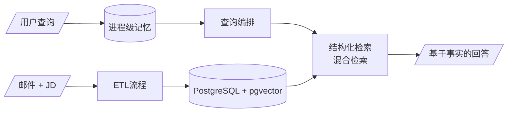

<h1 align="center">Heard Back Yet</h1>

<p align="center">
  一个面向个人求职进展追踪的在线问答工具，帮助求职者降低反复回应亲友有关申请进度、收信历史、岗位要求等问题的沟通成本。
</p>

<p align="center">
  <a href="https://heardbackyet.pages.dev"><strong>在线试用</strong></a>
  <br><br>
  <a href="./README.md">English</a> | 中文
</p>

## 🔍系统概览



| 关键图表 | 内容 |
| --- | --- |
| [**RAG问答流程**](./docs/rag_query_pipeline.md) | 用户查询如何转化为基于证据的回答 |
| [分层架构](./docs/layered_architecture.md) | 系统主要分层及其职责 |
| [ETL数据流](./docs/etl_pipeline.md) | 邮件和职位描述如何转化为相互关联的申请记录 |

## 🚀快速开始

本指南默认项目于Windows本地环境运行。

如需参考部署方案，详见[`docs/cloud_deployment.md`](./docs/cloud_deployment.md)。

```bash
git clone https://github.com/Kaichao-Zheng/Heard-Back-Yet.git
```

### 激活虚拟环境

```bash
# 创建虚拟环境
python -m venv .venv

# 激活虚拟环境
source .venv/bin/activate    # macOS/Linux
.\.venv\Scripts\activate     # Windows PowerShell
```

### 安装项目依赖

```bash
pip install -r requirements.txt
```

### 配置环境变量

复制根目录下的 `.env.local.example`，并将副本重命名为 `.env`。

```env
POSTGRES_HOST=localhost
POSTGRES_PORT=5432
POSTGRES_DB=heardbackyet
POSTGRES_USER=postgres
POSTGRES_PASSWORD=postgres

MODEL_PROVIDER=ollama
# MODEL_PROVIDER=alibaba_model_studio

OLLAMA_URL=http://localhost:11434
MODEL_BASE_URL=https://your-openai-compatible-endpoint.example/v1
MODEL_API_KEY=

TEXT_CLASSIFICATION_MODEL=qwen3.6:27b
ENTITY_EXTRACTION_MODEL=qwen3.5:9b
EMBEDDING_MODEL=qwen3-embedding:4b
INTENT_CLASSIFICATION_MODEL=qwen3.6:27b
RESPONSE_GENERATION_MODEL=qwen3.6:27b
```

> [!NOTE]
>
> 本地切换模型会产生冷启动延迟；多个模型同时驻留时还可能超出可用显存。云端模型无需本地加载，但会将模型输入发送给外部服务。
>
> 1. 更换Embedding服务商或模型后，需重建向量索引。
> 2. `MODEL_PROVIDER=alibaba_model_studio`使用OpenAI兼容接口，并支持`enable_thinking`等扩展参数。

### 验证模型API

以下命令会检查每个配置了模型的独立模块：

```powershell
python -m scripts.diag.smoke_model_api
```

使用本地Ollama时，完整烟测需要依次加载多个模型，可能耗时较长。

### 启动PostgreSQL

启动 [`compose.yaml`](./compose.yaml) 中定义的Docker PostgreSQL服务：

```bash
docker compose up -d postgres
```

虽然`PostgreSQL`可以本地运行，但在Windows上构建`pgvector`较为繁琐；使用Docker可以避免这部分配置。

### 从数据处理到用户查询

从仓库根目录按顺序执行以下步骤。

#### 1. 添加源文件

- 申请相关邮件（`.eml`）→ `data/eml/`
- 半结构化职位描述（`.md`）→ `data/jd/`

#### 2. 处理源文件

```bash
python -m scripts.run_data_pipeline
```

#### 3. 手动规范化实体别名

依[`scripts/normalize_aliases.md`](./scripts/normalize_aliases.md)完成实体命名的人工规范化。

#### 4. 构建PostgreSQL数据和语义检索向量

```bash
# rebuild = reset + load + index
python -m scripts.manage_db rebuild

python -m scripts.manage_db reset
python -m scripts.manage_db load
python -m scripts.manage_db index
```

`reset`会重建数据库，然后执行所有Alembic migration，直至最新版本。

#### 5. 查询求职申请

可以通过以下不同入口运行同一个查询。

默认本地开发模式下，将`.env.local.example`复制为`.env`。Compose只启动PostgreSQL，FastAPI继续直接运行在虚拟环境中。

云部署时，需从`.env.cloud.example`开始配置，并按照部署指南使用明确的`docker compose --profile cloud`命令启动migration、FastAPI和Nginx的docker容器。展示层MVP在边缘使用Cloudflare HTTPS，云服务器则通过`80`端口提供HTTP Nginx源站。详见[`docs/cloud_deployment.md`](./docs/cloud_deployment.md)。

**选项 A — Web UI**

在`8000`端口启动Uvicorn开发服务器：

```powershell
python -m uvicorn heardbackyet.main:app --reload
```

在浏览器中打开[`http://localhost:8000/`](http://localhost:8000/)。

在**服务器终端**中按`Ctrl+C`停止Uvicorn。

**选项 B — HTTP API**

保持同一Uvicorn服务运行，然后在另一个终端发送查询：

```powershell
curl.exe --json '{"user_query":"平安那边有消息吗","conversation_id":"demo-1"}' `
  http://localhost:8000/api/v1/responses

curl.exe --json '{"user_query":"那安克呢","conversation_id":"demo-1"}' `
  http://localhost:8000/api/v1/responses
```

在**服务器终端**中按`Ctrl+C`停止Uvicorn。

**选项 C — 诊断 CLI**

直接运行**不带记忆**的查询流程：

```powershell
python -m scripts.run_query "哪些岗位要求AWS"
```

> [!NOTE]
>
> `哪些岗位要求AWS`是一个有意保留歧义的回归查询：
>
> - 主要语料为中文，因此该查询可以避免跨语言噪声。
> - 它能够暴露整个工作流中的UTF-8处理问题。
> - 它位于`missing_scope`和`content_search`的模糊边界。
> - 它包含精确词项AWS，可用于验证混合检索优化。
>   - 对于该查询，语义检索器会将邮件证据排在JD之前。

**补充：检查诊断节点**

完整的RAG问答流程在 [`docs/rag_query_pipeline.md`](./docs/rag_query_pipeline.md)。

```powershell
# 测试回答模型访问
python -m scripts.run_query "哪些岗位要求AWS" --llm-only

# 检查检索证据
python -m scripts.run_query "哪些岗位要求AWS" --evidence

# 检查意图分类器的交接结果
python -m scripts.run_query "哪些岗位要求AWS" --query-spec
```

**补充：底层检索工具**

```powershell
# 结构化检索
python -m scripts.query_applications overview --limit 3

# 语义检索
python -m scripts.search_chunks "那些岗位发了评测" `
  --mode semantic `
  --source-type email `
  --email-type assessment `
  --hydrate

# 关键词检索
python -m scripts.search_chunks "AWS" `
  --mode lexical `
  --source-type job_description `
  --hydrate

# 混合检索（语义与词法通过RRF融合）
python -m scripts.search_chunks "哪些岗位要求AWS" `
  --mode hybrid `
  --source-type job_description `
  --semantic-weight 1.0 `
  --lexical-weight 1.0 `
  --hydrate
```

## 📊评估

请先[激活虚拟环境](#激活虚拟环境)，再从仓库根目录执行以下命令。

### 1. 评估LLM邮件分类任务

- Expected列需要人工标注。

```powershell
python -m scripts.eval.evaluate_email_classifier
```

**覆写：**

- [`data/eval/label_comparison.csv`](./data/eval/label_comparison.csv)
- [`data/eval/label_metrics.csv`](./data/eval/label_metrics.csv)

### 2. 评估LLM邮件实体抽取任务

- Expected列需要人工标注。

```powershell
python -m scripts.eval.evaluate_email_entity_extractor
```

**覆写：**

- [`data/eval/company_comparison.csv`](./data/eval/company_comparison.csv)
- [`data/eval/company_metrics.csv`](./data/eval/company_metrics.csv)
- [`data/eval/position_comparison.csv`](./data/eval/position_comparison.csv)
- [`data/eval/position_metrics.csv`](./data/eval/position_metrics.csv)

### 3. 可视化Embedding空间PCA

- 需要PostgreSQL中已有索引的检索文本块，并使用当前配置的Embedding模型。

```powershell
python -m scripts.eval.visualize_embeddings
```

**覆写：**

- [`data/eval/embedding_space_pca.png`](./data/eval/embedding_space_pca.png)

### 4. 评估LLM查询意图分类任务

对已保存的模型预测结果评分：

```powershell
python -m scripts.eval.evaluate_query_intent_classifier
```

重新生成预测结果：

- Expected列需要人工标注。
- 此命令会调用当前配置的LLM。

```powershell
python -m scripts.eval.evaluate_query_intent_classifier --force
```

**覆写：**

- [`data/eval/intent_comparison.csv`](./data/eval/intent_comparison.csv)
- [`data/eval/intent_metrics.csv`](./data/eval/intent_metrics.csv)
