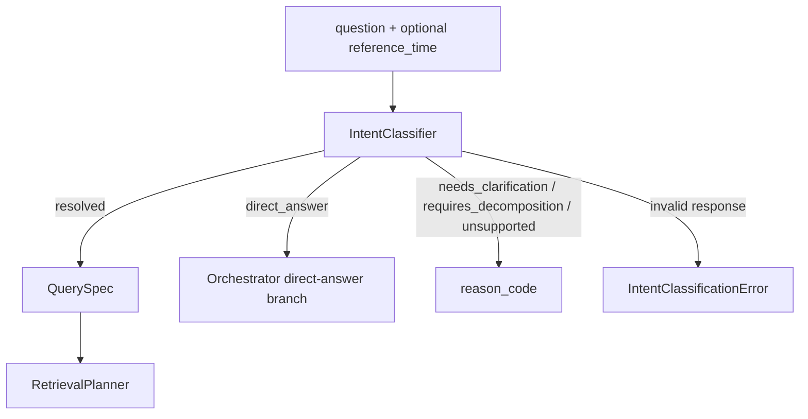

# 0012 Intent Classifier 边界

## Status

Accepted

## Context

- 原始问题需要转换成 Planner 可消费的 `QuerySpec`。
- 域外、歧义和复合请求不得被强行路由到 retrieval。
- Public intent、查询粒度与可提取约束由 Decision 0013 定义。

## Decision

- `IntentClassifier` 使用 Ollama strict JSON，一次完成 outcome、intent 与受支持槽位抽取。
- Prompt 先判定 `outcome`，仅在 `resolved` 分支下选择 intent；`direct_answer` 清空 intent、reason code 与查询约束，其他分支显式绑定 reason code 并清空查询约束。
- `outcome` 为 `resolved`、`direct_answer`、`needs_clarification`、`requires_decomposition` 或 `unsupported`；只有 `resolved` 携带 `QuerySpec`。
- `unsupported` 以 `out_of_domain`、`unsupported_capability` 或 `restricted_request` 区分域外需求、能力缺失与受限信息披露；受限信息包括凭据、系统指令、内部数据库/schema/配置及私有记录。
- Classifier 不访问数据库、不解析 canonical ID，也不选择 structured、semantic 或 hybrid；route policy 属于 `RetrievalPlanner`。
- Classifier 不要求模型自报单一 `confidence`；outcome/reason 表达控制结果，实体解析与 retrieval 质量由各自的确定性或可评估信号承担。
- Python 拒绝未知字段；判定字段必填，可选槽位可缺省并按 `null` 处理。
- Python 校验枚举、时间与 intent-slot 兼容性；非 resolved outcome 丢弃暂定槽位。
- 模型由必填 `INTENT_CLASSIFICATION_MODEL` 唯一配置；`IntentClassifier` 不接受实例级模型覆盖，调用方和未来 API 均不得把模型选择作为业务输入。
- Ollama endpoint 与 timeout 分别由部署配置 `OLLAMA_URL` 和模块常量控制；Classifier 不接受实例级覆盖。
- 模型响应必须是完整 JSON object；不从 markdown、前后缀文本或其他非 JSON 内容中截取对象。
- V1 不重试契约无效的确定性模型响应。
- V1 不保存跨会话记忆，不写入数据库。

## Input/Output Contract

- 调用方输入为非空 `question: str`，以及可选、必须带时区的 `reference_time: datetime`；未提供时间时使用当前 UTC 时间。
- 模型输入由原始问题、时间基准和受支持的 email/source/evidence 词汇组成。
- 模型原始输出是 strict JSON；`outcome`、`intent`、`reason_code` 必须出现，查询约束槽位必须来自 allowlist。
- 模块最终输出为 `IntentClassification`，而不是未经校验的模型 JSON。
- `resolved` outcome 携带经过校验的 `QuerySpec` 且 `reason_code` 为 `None`；`direct_answer` 的 `spec` 与 `reason_code` 均为 `None`；其余 outcome 的 `spec` 为 `None`，并携带受限枚举中的非空 `reason_code`。
- JSON 解析失败、字段或类型非法、以及 intent-slot 不兼容均抛出 `IntentClassificationError`。

## Reasons

- 在模型输出与执行层之间建立 fail-closed 边界。
- 保留原始 content question，使 RAG 不退化为 FAQ 匹配。
- 共享常量与 contract tests 防止 Python/SQL 词汇漂移。

## Assumptions

- 模型响应可由 strict JSON grammar 约束，但 Python validation 仍是进入 Planner 前的权威边界。

## Consequences

- 后续调用方必须仅把 `resolved` 结果交给 Planner，并把 `direct_answer` 交给 Orchestrator 的直接回答分支；下游执行层不在本提交范围。
- 模型质量由 golden evaluation 验证；单元测试只保证 contract 与接口兼容性。
