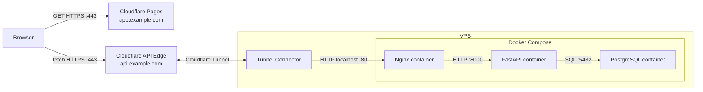

# Cloud Deployment (Linux VPS)

Follow these steps in order. Commands run on the Linux VPS unless a step says
otherwise.

## Runtime topology



## 1. Configure VPS networking

In the VPS security group, allow inbound traffic for:

- SSH `22` from your own IP.

Do not open HTTP `80`, HTTPS `443`, PostgreSQL `5432`, or FastAPI `8000` to the
internet.

Keep outbound traffic allowed so `cloudflared` can establish the
encrypted tunnel to Cloudflare.

## 2. Install Prerequisites

### `SSH` into your VPS

```powershell
ssh -i "$HOME\<path-to-key>\heardbackyet.pem" <vps-user>@<vps-ip>
```

### Install Prerequisites

```bash
sudo apt update

sudo apt install -y git docker.io docker-compose-v2
sudo systemctl enable --now docker
sudo usermod -aG docker "$USER"

git --version
docker --version
docker compose version

exit
```

## 3. Configure Cloudflare Tunnel

In the Cloudflare dashboard:

1. Create a **Cloudflare Tunnel**

2. Install a Linux **tunnel connector replica** using the Cloudflare-provided commands.
   
   The Connection Status remains at `No connection detected yet`.

3. Back to the **Tunnel dashboard** and verify that the status is `Healthy`.

4. Add a **published application route** from `api.example.com` to `http://localhost:80`.

   Cloudflare will create the tunnel DNS record automatically.

## 4. Prepare the VPS repository

Clone the repository and enter it:

```bash
git clone https://github.com/Kaichao-Zheng/Heard-Back-Yet.git
cd Heard-Back-Yet
```

## 5. Upload the data

The Git repository and Docker image do not contain `data/`. From the local
Windows PowerShell, run:

```powershell
scp -i "$HOME\<path-to-key>\heardbackyet.pem" -r .\data <vps-user>@<vps-ip>:/home/<vps-user>/Heard-Back-Yet/
```

## 6. Create the environment file

Copy the example and edit it:

```bash
cp .env.cloud.example .env
vim .env
```

At minimum, replace all placeholder credentials and set:

```env
POSTGRES_HOST=postgres
POSTGRES_PORT=5432
POSTGRES_PASSWORD=<strong-password>

FRONTEND_API_BASE_URL=https://api.example.com
API_ALLOWED_FRONTEND_ORIGINS=https://app.example.com
API_DOMAIN=api.example.com
```

Also configure the selected model provider, endpoint, API key, and model names.

## 7. Initialize and start the containerized backend

### Bootstrap the cloud backend

```bash
# Start PostgreSQL for the database rebuild.
docker compose --profile cloud up -d postgres

# Rebuild the database from the read-only data directory.
docker compose --profile cloud run --rm --no-deps --build \
  -v "$(pwd)/data:/app/data:ro" \
  fastapi python -m scripts.manage_db rebuild

# Build and start the complete cloud stack.
docker compose --profile cloud up --build -d
```

If the cloud configuration uses a hosted embedding provider, this step sends embedding inputs to that provider.

### Test the backend before configuring Cloudflare Pages

```bash
curl http://localhost/health
curl https://api.example.com/health
```

## 8. Configure Cloudflare Pages

In Workers & Pages, connect the Git repository and deploy Pages with these settings:

| Setting | Value |
| --- | --- |
| Framework preset | `None` |
| Build command | `python -m pip install python-dotenv && python -m scripts.build_frontend --env-file /dev/null` |
| Build output directory | `dist` |
| Root directory | ` ` |

Add this Pages build environment variable:

```text
FRONTEND_API_BASE_URL=https://api.example.com
```

Deploy and open the Pages site:

```text
https://app.example.com
```

> [!NOTE]
> If the intended Pages project name is unavailable:
> - update the VPS `.env`
>   ```env
>   API_ALLOWED_FRONTEND_ORIGINS=https://actual.app.example.com
>   ```
>
> - recreate FastAPI
>   ```bash
>   docker compose --profile cloud up -d --no-deps --force-recreate fastapi
>   ```

Submit one query in the browser. A successful response confirms Pages, CORS, Cloudflare proxying, Nginx, FastAPI, PostgreSQL, and the model provider together.

The cloud profile persists Weixin login state in `heardbackyet_weixin_state` across FastAPI container replacement. This demo has no application-level authentication, so use desensitized data when the API is public.

## 9. Later code updates

For later backend updates, do not rebuild frozen data:

```bash
git pull
docker compose --profile cloud up --build -d
```

The one-shot `migrate` container applies pending schema migrations before
FastAPI starts. Pages automatically rebuilds after pushes to its configured Git
branch.

## What the local code becomes in cloud

| Local VS Code item | Cloud result |
| --- | --- |
| `heardbackyet/static/` | `dist/` deployed by Cloudflare Pages |
| `scripts/build_frontend.py` | writes the public API URL into the Pages artifact |
| `heardbackyet.main:app` | private `fastapi:8000` container |
| Weixin runtime state | private `heardbackyet_weixin_state` volume |
| `python -m alembic upgrade head` | one-shot `migrate` container |
| `python -m scripts.manage_db rebuild` | first database bootstrap container |
| `deploy/nginx/templates/default.conf.template` | public VPS HTTP origin on port `80` |
| `POSTGRES_HOST=postgres` | Compose DNS name for the PostgreSQL container |
