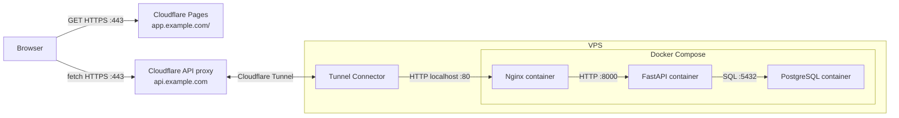

# Cloud Deployment (Linux VPS)

Follow these steps in order. Commands run on the Linux VPS unless a step says
otherwise.

## Runtime topology



## 1. Configure AWS networking

In the VPS security group, allow inbound traffic for:

- SSH `22` from your own IP.

Do not open HTTP `80`, HTTPS `443`, PostgreSQL `5432`, or FastAPI `8000` to the
internet.

Keep outbound traffic allowed so `cloudflared` can establish the
encrypted tunnel to Cloudflare.

## 2. Configure Cloudflare

In the Cloudflare dashboard:

1. Create a Cloudflare Tunnel and install its Linux connector on the VPS.
2. Wait until the tunnel status is `Healthy`.
3. Without creating an `A` record, add a published application route from
   `api.example.com` to `http://localhost:80`.

   Cloudflare will create the tunnel DNS record automatically.

## 3. Install Prerequisites

`SSH` into your VPS, then:

```bash
sudo apt update

sudo apt install -y git docker.io docker-compose-v2
sudo systemctl enable --now docker
sudo usermod -aG docker "$USER"

git --version
docker --version
docker compose version

exit
```

## 4. Prepare the VPS repository

Clone the repository and enter it:

```bash
git clone https://github.com/Kaichao-Zheng/Heard-Back-Yet.git
cd Heard-Back-Yet
```

## 5. Upload the frozen data

The Git repository and Docker image do not contain `data/`. From the local
Windows PowerShell, run:

```powershell
scp -i "$HOME\path\to\your-key.pem" -r .\data <vps-user>@<vps-ip>:/home/<vps-user>/Heard-Back-Yet/
```

## 6. Create the cloud environment

Copy the example and edit it:

```bash
cp .env.cloud.example .env
vim .env
```

At minimum, replace all placeholder credentials and set:

```dotenv
POSTGRES_HOST=postgres
POSTGRES_PORT=5432
POSTGRES_PASSWORD=<strong-password>

FRONTEND_API_BASE_URL=https://api.example.com
API_ALLOWED_FRONTEND_ORIGINS=https://app.example.com
API_DOMAIN=api.example.com
```

Also configure the selected model provider, endpoint, API key, and model names.

## 7. Initialize and start the backend

Start PostgreSQL, rebuild the first cloud database from the copied data, and
then start the complete cloud stack:

```bash
docker compose --profile cloud up -d postgres
docker compose --profile cloud run --rm --no-deps --build \
  -v "$(pwd)/data:/app/data:ro" \
  fastapi python -m scripts.manage_db rebuild
docker compose --profile cloud up --build -d
```

If the cloud configuration uses a hosted embedding provider, this step sends
embedding inputs to that provider.

Test the public API before configuring Cloudflare Pages:

```bash
curl https://api.example.com/health
```

## 8. Configure Cloudflare Pages

In Workers & Pages, connect the Git repository and deploy Pages use:

```text
Framework preset: None
Build command: python -m pip install python-dotenv && python -m scripts.build_frontend --env-file /dev/null
Build output directory: dist
Root directory: /
```

Add this Pages build environment variable:

```text
FRONTEND_API_BASE_URL=https://api.example.com
```

Deploy and open:

```text
https://app.example.com
```

> [!NOTE]
> `app.example.com` is a placeholder. If the intended Pages project name is
> unavailable, set `API_ALLOWED_FRONTEND_ORIGINS=actual.pages.dev` in the VPS `.env`
> production URL, then reload only FastAPI:
>
> ```bash
> docker compose --profile cloud up -d --no-deps --force-recreate fastapi
> ```

Submit one query in the browser. A successful response confirms Pages, CORS,
Cloudflare proxying, Nginx, FastAPI, PostgreSQL, and the model provider together.

## 9. Deploy later code updates

For later backend updates, do not rebuild frozen data:

```bash
git pull
docker compose --profile cloud up --build -d
```

The one-shot `migrate` container applies pending schema migrations before
FastAPI starts. Pages automatically rebuilds after pushes to its configured Git
branch.

## What the local code becomes in cloud

| Local VS Code item | Cloud result |
| --- | --- |
| `heardbackyet/static/` | `dist/` deployed by Cloudflare Pages |
| `scripts/build_frontend.py` | writes the public API URL into the Pages artifact |
| `heardbackyet.main:app` | private `fastapi:8000` container |
| `python -m alembic upgrade head` | one-shot `migrate` container |
| `python -m scripts.manage_db rebuild` | first database bootstrap container |
| `deploy/nginx/templates/default.conf.template` | public VPS HTTP origin on port `80` |
| `POSTGRES_HOST=postgres` | Compose DNS name for the PostgreSQL container |
