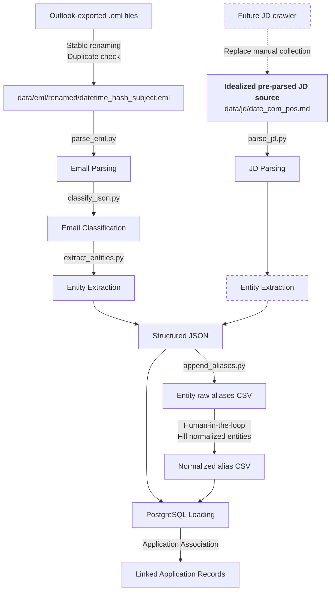

```mermaid
flowchart TD
    EML["Outlook-exported .eml files"] --> |"Stable renaming<br/>Duplicate check"| RENAMED["data/eml/renamed/datetime_hash_subject.eml"]
    RENAMED --> |"parse_eml.py"| EML_JSON["Email Parsing"]
    EML_JSON --> |"classify_json.py"| EML_CLASSIFY["Email Classification"]
    EML_CLASSIFY --> |"extract_entities.py"| EML_EXTRACT["Entity Extraction"]

    CRAWLER["Future JD crawler"] -.-> |"Replace manual collection"| JD
    JD["<b>Idealized pre-parsed JD source</b><br/>data/jd/date_com_pos.md"] --> |"parse_jd.py"| JD_JSON["JD Parsing"]
    JD_JSON ---> JD_EXTRACT["Entity Extraction"]

    EML_EXTRACT --> STRUCTURED_JSON["Structured JSON"]
    JD_EXTRACT --> STRUCTURED_JSON

    STRUCTURED_JSON --> |append_aliases.py| RAW_CSV["Entity raw aliases CSV"]
    RAW_CSV --> |"Human-in-the-loop<br/>Fill normalized entities"| NORM_CSV["Normalized alias CSV"]

    STRUCTURED_JSON --> DB_LOAD["PostgreSQL Loading"]
    NORM_CSV --> DB_LOAD

    DB_LOAD --> |"Application Association"| LINKED["Linked Application Records"]

    classDef dashed stroke-dasharray: 5 5;
    class CRAWLER,JD_EXTRACT dashed;
```
