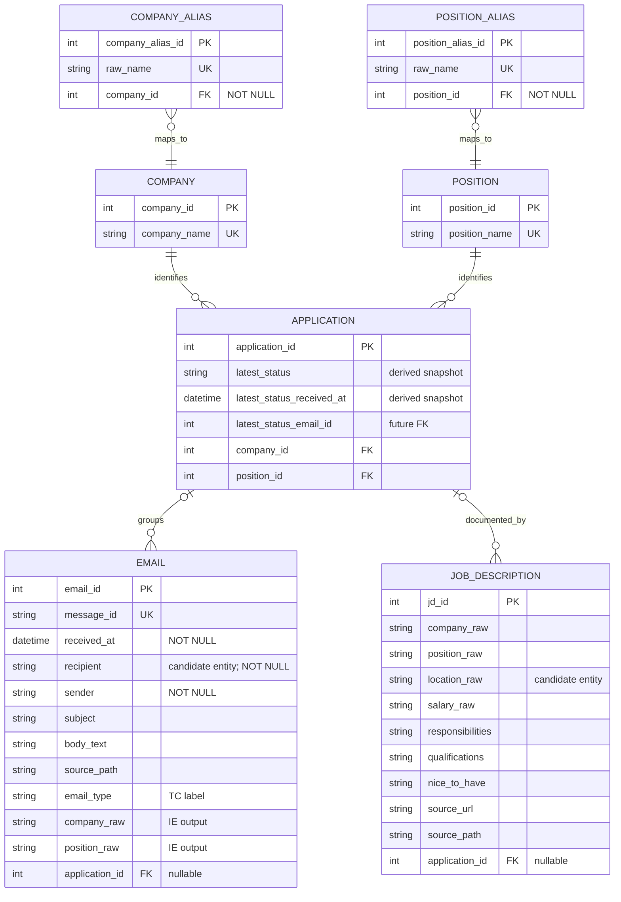

```mermaid
erDiagram
    COMPANY_ALIAS {
        int company_alias_id PK
        string raw_name UK
        int company_id FK "NOT NULL"
    }

    POSITION_ALIAS {
        int position_alias_id PK
        string raw_name UK
        int position_id FK "NOT NULL"
    }

    COMPANY {
        int company_id PK
        string company_name UK
    }

    POSITION {
        int position_id PK
        string position_name UK
    }

    APPLICATION {
        int application_id PK
        string latest_status "derived snapshot"
        datetime latest_status_received_at "derived snapshot"
        int latest_status_email_id "future FK"
        int company_id FK
        int position_id FK
    }

    EMAIL {
        int email_id PK
        string message_id UK
        datetime received_at "NOT NULL"
        string recipient "candidate entity; NOT NULL"
        string sender "NOT NULL"
        string subject
        string body_text
        string source_path
        string email_type "TC label"
        string company_raw "IE output"
        string position_raw "IE output"
        int application_id FK "nullable"
    }

    JOB_DESCRIPTION {
        int jd_id PK
        string company_raw
        string position_raw
        string location_raw "candidate entity"
        string salary_raw
        string responsibilities
        string qualifications
        string nice_to_have
        string source_url
        string source_path
        int application_id FK "nullable"
    }

    
    COMPANY_ALIAS }o--|| COMPANY : maps_to
    POSITION_ALIAS }o--|| POSITION : maps_to
    
    COMPANY ||--o{ APPLICATION : identifies
    POSITION ||--o{ APPLICATION : identifies

    APPLICATION |o--o{ EMAIL : groups
    APPLICATION |o--o{ JOB_DESCRIPTION : documented_by
```
