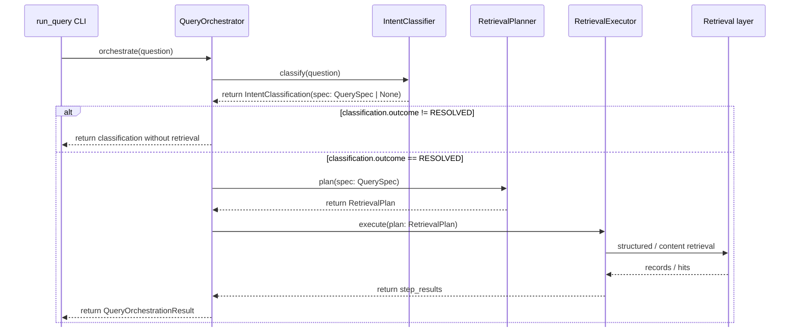

## Responsibilities

- `run_query CLI`：装配依赖，只把 outcome、reason code 和最终 step results
  序列化为 JSON；retrieval plan 与中间 step results 不向默认 CLI 输出暴露。
- `QueryOrchestrator`：调用 Classifier；没有可执行 `QuerySpec` 时返回，否则依次
  调用 Planner 和 Executor。
- `IntentClassifier`：判断 outcome、识别 intent、提取用户明确表达的约束，并且
  只为 `resolved` 结果生成 `QuerySpec`。
- `RetrievalPlanner`：根据 `QuerySpec` 的 intent 与 scope 选择计划拓扑，构造
  structured 或 content retrieval steps。
- `RetrievalExecutor`：执行计划步骤，调用下层各类 retrievers

## Two Hybrid Concepts

- `RetrievalMode.HYBRID` 是 orchestration 拓扑：先解析 company，再执行内容检索。
- `RetrievalBackend.HYBRID` 是下层排序实现：semantic 与 lexical 结果通过 RRF
  融合。
