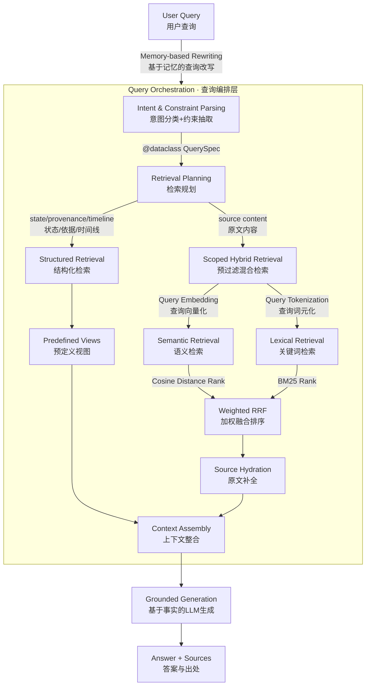

```mermaid
flowchart TD
    A["User Query<br/>用户查询"]
    B["Intent & Constraint Parsing<br/>意图分类+约束抽取"]
    C["Retrieval Planning<br/>检索规划"]

    D1["Structured Retrieval<br/>结构化检索"]
    D2["Scoped Hybrid Retrieval<br/>预过滤混合检索"]
    E1["Semantic Retrieval<br/>语义检索"]
    E2["Lexical Retrieval<br/>关键词检索"]
    F1["Predefined Views<br/>预定义视图"]
    F2["Weighted RRF<br/>加权融合排序"]
    G["Source Hydration<br/>原文补全"]

    H["Context Assembly<br/>上下文整合"]
    I["Grounded Generation<br/>基于事实的LLM生成"]
    J["Answer + Sources<br/>答案与出处"]

    A -->|"Memory-based Rewriting<br/>基于记忆的查询改写"| O

    subgraph O["Query Orchestration · 查询编排层"]
        B --> |"@dataclass QuerySpec"| C
        C --> |"state/provenance/timeline<br/>状态/依据/时间线"| D1
        C --> |"source content<br/>原文内容"| D2

        D1 --> F1
        F1 ----> H

        D2 --> |"Query Embedding<br/>查询向量化"| E1
        D2 --> |"Query Tokenization<br/>查询词元化"| E2
        E1 --> |"Cosine Distance Rank"| F2
        E2 --> |"BM25 Rank"| F2
        F2 --> G
        G --> H
    end

    H --> I
    I --> J

    click A href "https://github.com/Kaichao-Zheng/Heard-Back-Yet/blob/main/docs/sample_queries.md" "sample_queries.md" _self
    click B href "https://github.com/Kaichao-Zheng/Heard-Back-Yet/blob/main/docs/query_orchestration_sequence.md" "query_orchestration_sequence.md" _self
    click F1 href "https://github.com/Kaichao-Zheng/Heard-Back-Yet/blob/main/docs/view_dependencies.md" "view_dependencies.md" _self
```
