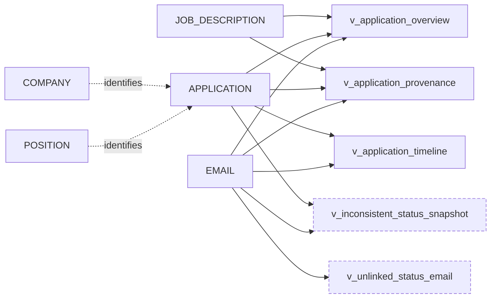

```mermaid
flowchart LR
    %% Normalized Entities
    COMPANY[COMPANY]
    POSITION[POSITION]

    %% Core Tables
    JOB_DESCRIPTION[JOB_DESCRIPTION]
    APPLICATION[APPLICATION]
    EMAIL[EMAIL]

    %% Query Views
    V1[v_application_overview]
    V2[v_application_provenance]
    V3[v_application_timeline]

    %% Review Queue
    V4[v_inconsistent_status_snapshot]
    V5[v_unlinked_status_email]

    COMPANY -. identifies .-> APPLICATION
    POSITION -. identifies .-> APPLICATION

    JOB_DESCRIPTION --> V1
    APPLICATION --> V1
    EMAIL --> V1

    JOB_DESCRIPTION --> V2
    APPLICATION --> V2
    EMAIL --> V2

    APPLICATION --> V3
    EMAIL --> V3

    APPLICATION --> V4
    EMAIL --> V4

    EMAIL --> V5

    classDef review stroke-dasharray: 5 3;
    class V4,V5 review;
```
