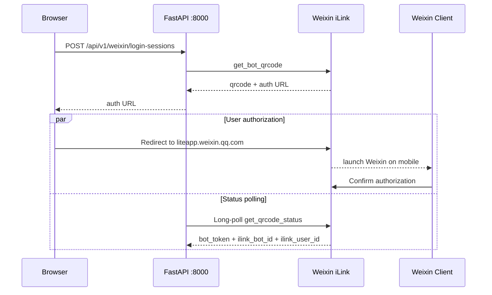

# Weixin iLink Bot Integration

## Current Design

- 使用 `nightsailer/wechat-clawbot` `master` 分支的基础 SDK，避免官方接入栈对OpenClaw的深度耦合
- `heardbackyet.main:app` 是唯一FastAPI应用进程，由 Uvicorn 默认监听 `127.0.0.1:8000`
- H5 获取 iLink 实时返回的一次性授权 URL 后直接跳转；`liteapp.weixin.qq.com` ，用户自行处理扫码与微信唤起
- 微信授权后创建并绑定自己的iLink Bot，不同微信账号相互独立
- 多个 iLink Bot 共用同一套 HeardBackYet 查询和回复能力，但账号凭据、消息进度、会话状态彼此隔离

第三方库或 iLink 行为变化时，应替换 `presentation/weixin/runtime.py` 中的渠道 runtime，不改查询、检索或回答生成链路。

## Authorization Flow



`qrcode` 是 iLink 状态轮询标识，只保存在后端 SDK 内存中。前端只收到 `qrcode_img_content` 对应的 HTTPS 官方页面地址，不接收 provider session key、登录状态或本站二维码图片。

`bot_token`、`ilink_bot_id` 和原始 `ilink_user_id` 不进入浏览器响应，也不写入仓库。

## Conversation and Weixin Identity

iLink 扫码回答“哪个微信账号拥有这个个人 Bot”。当前 MVP 尚未引入 HeardBackYet 用户或管理员身份，默认所有能访问 H5 的会话都可以创建一次 iLink 登录会话：

1. 用户点击“微信快问”后，H5 直接创建 iLink 登录会话，不输入管理口令。
2. 扫码确认后，iLink 返回的 `ilink_user_id` 与该 Bot 凭据一同保存。
3. 以后收到消息时，runtime 要求 `from_user_id == ilink_user_id`；不匹配的消息不会进入查询链路。
4. `conversation_id` 由 `HMAC(conversation_secret, bot_id + sender_id)` 派生，不暴露微信身份。

这一边界适用于本机、局域网或受控演示。公开部署前应增加正式登录、管理员开关或限流，不能把“能访问页面”等同于长期授权。

## Configuration

默认无需设置环境变量。首次启动会在仓库外状态目录生成并持久化内部 `conversation-secret`。如需覆盖默认目录或已有密钥，可选设置：

```powershell
$env:HBY_WEIXIN_CONVERSATION_SECRET = "替换为至少32字符的随机密钥"
$env:HBY_WEIXIN_STATE_DIR = "D:\private\heardbackyet-weixin"
```

可选配置：

```powershell
$env:HBY_WEIXIN_LOGIN_TIMEOUT_SECONDS = "240"
$env:HBY_WEIXIN_MAX_ACTIVE_LOGINS = "4"
$env:HBY_WEIXIN_MAX_REPLY_CHARS = "3500"
```

规则：

- 未配置 `HBY_WEIXIN_CONVERSATION_SECRET` 时，服务端在状态目录创建一次并在后续启动复用；该密钥不进入浏览器。
- 未配置 `HBY_WEIXIN_STATE_DIR` 时，Windows 默认使用 `%LOCALAPPDATA%\HeardBackYet\weixin`，其他系统使用 `~/.heardbackyet/weixin`。
- 登录有效期限制在 30–290 秒内，与第三方 SDK 的活动登录 TTL 保持边界一致。
- SDK 会在等待函数内部处理登录轮询；官方页面过期时，用户返回 H5 再次点击即可创建新会话。
- 生产环境应显式配置仓库外私有目录，并在公开访问前补充身份或限流边界。

## Usage

```bash
python -m uvicorn heardbackyet.main:app --host 127.0.0.1 --port 8000 --workers 1
```

然后打开 `http://localhost:8000/`：

1. 点击“微信快问”。
2. H5 创建一次性登录会话并跳转 `liteapp.weixin.qq.com`。
3. PC 在官方页面扫码；手机由官方页面唤起微信。
4. 在微信中确认授权后，直接在个人 Bot 中发送文本问题。

主 API 暂时必须保持单 worker，因为登录会话、账号 poller 与对话 Store 都由当前进程持有。已确认的 Bot 凭据和 iLink sync cursor 会写入状态目录，FastAPI 重启后会恢复个人 Bot 长轮询；未完成的二维码登录会话不会恢复。

撤销某个个人 Bot 时，停止 FastAPI，删除状态目录 `accounts/` 下对应的凭据文件及 `sync/` 下对应 cursor，再启动 FastAPI。初版没有把撤权入口暴露给 H5，避免浏览器误删 Bot 凭据。

## Credentials and Privacy

- 状态目录中的账号 JSON 含 `bot_token`，必须限制为部署用户可读，不得提交 Git、同步到公开网盘或写进日志。
- iLink 返回的授权入口和 API base URL 必须是 HTTPS；账号文件名使用 Bot ID 的 SHA-256 摘要，远端 ID 不能控制本地路径。
- 回答中只输出可由手机访问的公共 `source_url`；本地 `.eml` 路径不会进入微信回复。
- `context_token` 仅随当前 iLink 回复使用，不作为语义会话 ID。
- 消息 ID 使用进程内有界集合去重；iLink cursor 由固定 SDK 持久化。
- 当前实现不归档消息正文，也不记录原始用户 ID 或 token。

